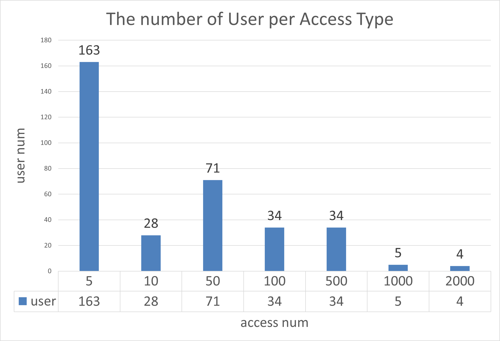
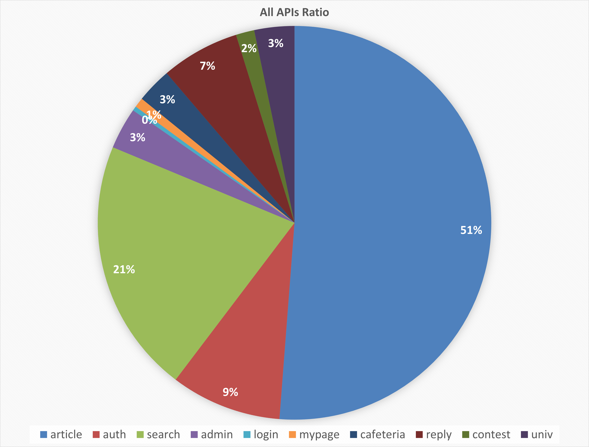
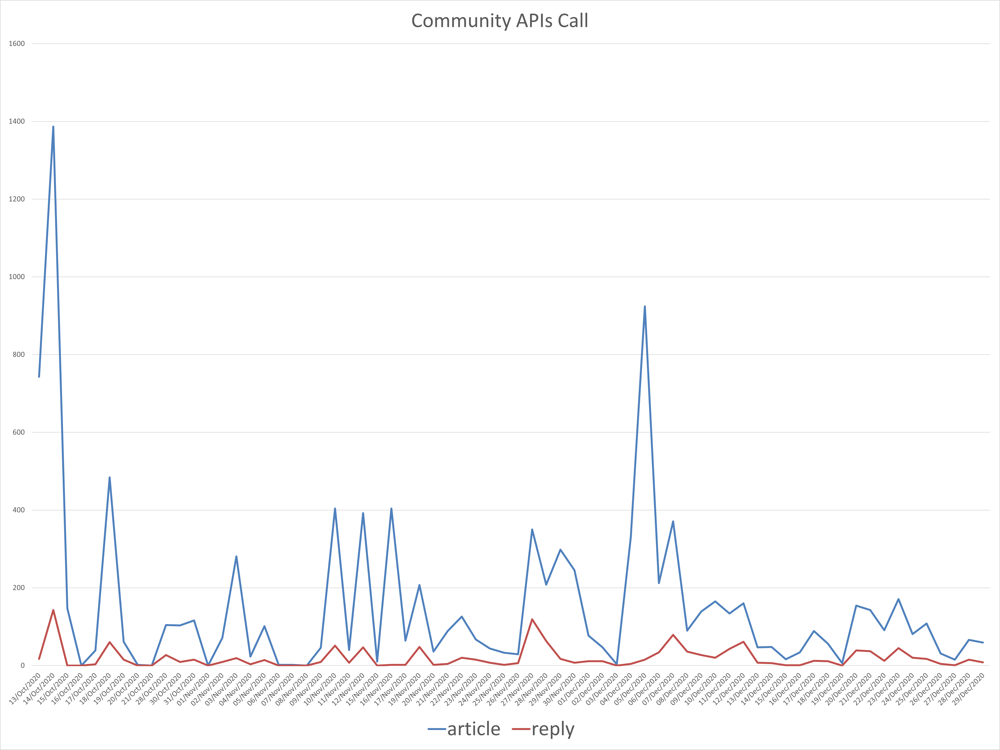
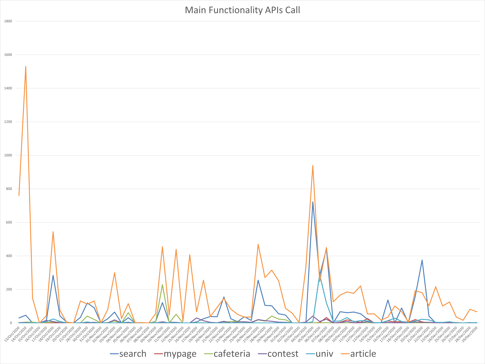
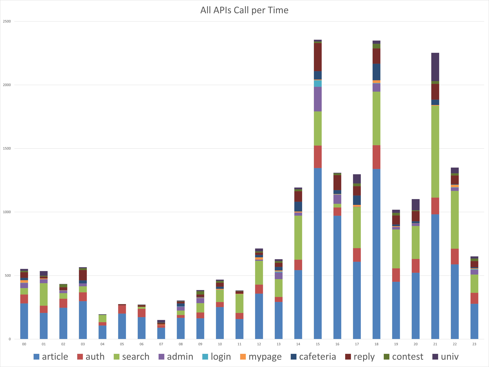

# Service Log Analysis

This log data are collected from 13/Oct/2020 ~ 30/Dec/2020. We analysis our log data to outcome meaningful result of our service. We summarize our analysis to 4 points.

1. Our main user type are light and middle type.
2. The most popular functionality among users is community, especially reading articles.
3. Univ ranking and searching functionality has the most biggest potential. 
4. Most user use our service between 15 and 20.

More details about why these result comes are explained below.

## User Type

We define light user as "access our app less than 10" and middle user as "access our app more than 10 and less than 500" and heavy user as "access our app more than 500". As you can see in the below graph, **the light user is about 190 and middle user is about 170 and heavy user is about 10.** So half of user access our app below 10 times and the other access our app more than 10 and less than 500. 

## Popularity

This is APIs call frequent ratio pi graph. 51% of APIs call is related to article.

In the article APIs, article apis are more used than reply apis. And we can find a little relationship between two. The more article apis used, the more reply apis used.  

## Potential

The most potential functionality is univ and searching. Univ page is launched at 1/Dec/2020. As times go, the frequent of api call increase too. You can see that in the below graph.

## Crowded Time

Users use our system during day, especially at 15, 18, 21. 

